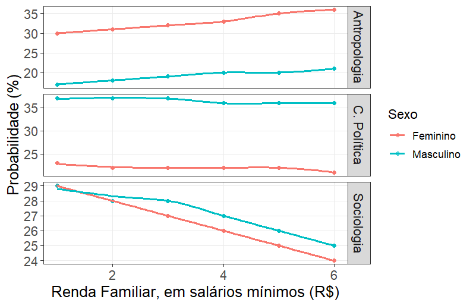

Neste post, resultado de uma comunicação de pesquisa, exploraremos tendências de estratificação social na carreira de Ciências Sociais da USP. Vamos investigar, mais especificamente, os preditores para as escolhas das grandes áreas: Sociologia, Antropologia e Ciência Política.

## Objetivos

A presente comunicação compreende que a estratificação dos sistemas educacionais apresenta duas dimensões: vertical e horizontal. A primeira, diz respeito ao efeito das características adscritas do indivíduo sobre suas chances de completarem transições entre níveis educacionais. Já a segunda, trata de diferenças entre segmentos distintos dentro de um mesmo nível educacional, advindas dessas características adscritas (Mont'alvão, 2016). Assim a estratificação horizontal é um fenômeno caracteristicamente relacionado a tipos institucionais e campos de estudo. Logo, escolhas como o tipo de instituição de ensino superior, tipo de curso, e área do conhecimento são condicionadas, sobretudo, pela renda familiar, gênero, raça, e escolaridade dos pais (Carvalhaes e Ribeiro, 2019; Almeida e Ernica, 2015).

Em diálogo com essa literatura, objetivou-se observar a existência de tendências de preferência entre os ingressantes do curso de Ciências Sociais da USP pelas macro disciplinas Antropologia, Ciência Política e Sociologia, além de investigar se essas preferências variam conforme gênero, raça e renda familiar dos ingressantes.

## Métodos e procedimentos

A partir dos dados do censo anual "Perfil dos/das/des Ingressantes de Ciências Sociais da USP", realizado pelo PET-Ciências Sociais desde 2006, foram selecionadas as seguintes variáveis independentes: cor (de acordo com as categorias do IBGE), sexo e renda familiar média (rfm). A variável dependente é a área de interesse no curso, sendo Antropologia a categoria de referência. A amostra inclui 2.232 ingressantes entre 2006 e 2017.

Para a regressão logística multinomial, verificou-se que os pressupostos foram atendidos, incluindo a independência das observações, ausência de multicolinearidade e independência de alternativas irrelevantes (teste de Hausman-McFadden), assegurando a validade das estimativas dos coeficientes. O modelo de regressão é representado pela equação

$$
\log\left( \frac{P(Y=j)}{P(Y=k)} \right) = \beta_{0j} + \beta_{1j}(\text{sexo}) + \beta_{2j}(\text{cor}) + \beta_{3j}(\text{rfm})
$$

## Resultados preliminares

A **Tabela 1** sintetiza os resultados ao interpretar o modelo de regressão.

**Tabela 1: Coeficientes do modelo**

| Variável | LR Chisq |  Df |      Pr(\>Chisq) |
|----------|---------:|----:|-----------------:|
| **sexo** |   66.174 |   3 | 2.81×10⁻¹⁴\*\*\* |
| **cor**  |   10.080 |  12 |           0.6089 |
| **rfm**  |    2.260 |   3 |           0.5202 |

\*\*\*p \< 0.001

As pessoas do sexo masculino apresentam uma maior associação com a variável dependente areaint (LR Chisq = 66.174, Df = 3, p \< 0.001). Isso indica que o sexo é um preditor significativo para a área de interesse. Já a variável cor (LR Chisq = 10.080, Df = 12, p = 0.609) e a variável rfm (LR Chisq = 2.260, Df = 3, p = 0.520) não apresentam associações estatisticamente significativas com a variável dependente, sugerindo que esses fatores não contribuem de maneira relevante para explicar as variações em areaint.

Já a Figura 1 ilustra a relação entre a renda familiar, medida em salários mínimos, e a probabilidade de escolha da área de interesse, diferenciada por sexo. Observa-se que, para Antropologia, a probabilidade de escolha é consistentemente maior entre o sexo feminino, com uma leve tendência de aumento à medida que a renda cresce. Em contraste, para a Ciência Política, o sexo masculino tem uma probabilidade significativamente maior de escolha em todas as faixas de renda, com pouca variação em função da renda familiar. Para Sociologia, ambos os sexos apresentam uma tendência de diminuição da probabilidade de escolha conforme a renda aumenta, embora os homens iniciem com uma probabilidade maior em faixas de renda mais baixas, com a diferença se reduzindo em faixas de renda mais altas.

**Figura 1: Renda familiar e probabilidade de escolha da grande área**

